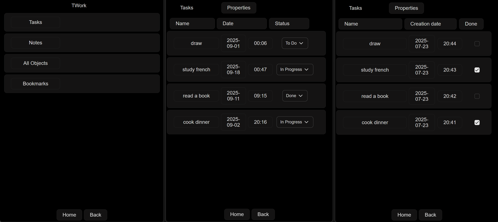

# AnyTask

[Anytype](https://github.com/anyproto/) has great desktop, Android and iOS clients. This project focuses on cross-platform compatibility between clients using [Dioxus](https://github.com/DioxusLabs/dioxus), a modern Rust framework.

The client is currently in active development and supports building for desktop and Android. The full portable version of the client will be available after the release of headless Anytype. Currently the app asks for network connection to official Anytype desktop app.

<div align="center">
  
</div>

## Features

- [x] Login with API token
- [x] Save/Remove API token
- [x] View Spaces
- [x] View Objects
- [x] View Queries
- [x] Text property
- [x] Done property
- [x] Tag property
- [x] Date/Time property
- [x] Choose viewed properties
- [x] Configure viewed properties
- [ ] Choose views
- [ ] Auth with 4-digit code
- [ ] Timeline view
- [x] Build for Android


## Installing Dependencies

- API code is generated with `openapi-generator-cli`.
- [dioxus-cli](https://github.com/DioxusLabs/dioxus)

### Windows, Linux

```bash
cargo install --git https://github.com/DioxusLabs/dioxus dioxus-cli --locked
```

### NixOS

```bash
nix develop
```

## Running

### Desktop

```bash
dx serve --platform desktop
```

### Android

- Android
  - Settings
  - Developer options
  - Wireless debugging (turn on, then hold)
  - Pair device with pairing code (`ip:port`, `code`)
- Terminal
  - Connect to device
    - `adb pair ip:port` - connect to device with wireless debugging
    - `code` - verify with code
    - `adb devices` - check connected devices
  - Run the app on the connected device
      ```bash
      dx serve --platform android --device
      ```
  - Debug
    - `adb shell run-as com.Tumypmyp.AnyTask` - login to Android shell
    - `ls files` - check app files directory

## Building installer

### Desktop
```bash
dx bundle --desktop
```

### Android
```bash
dx bundle --android
```
