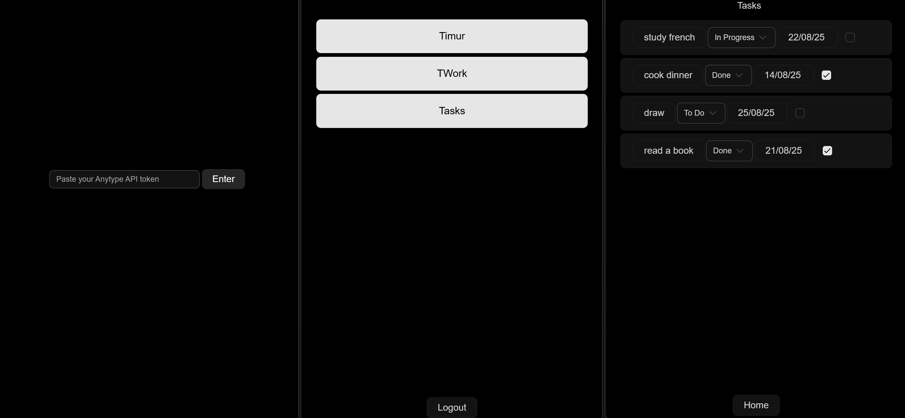

# Any tasks

Anytype has great desktop, Android and iOS clients. This project focuses on cross-platform compatibility using Dioxus, a modern Rust framework.

The client is currently in active development and supports only the desktop version of Anytype. The Android version will become available upon the release of the Anytype API for Android.

<div align="center">
  
</div>

## Features

- [x] Auth with Bearer token
- [x] Chose space
- [x] View tasks
- [ ] ...

## Development

The project includes `assets` folder and a `views` folder. API code is generated with `openapi-generator-cli` to `api`.

### Install Dioxus
```
cargo binstall dioxus-cli -y --force --version 0.7.0-alpha.3
```

### Serve the App

Run the following command in the root of your project to start developing with the default platform:

```bash
dx serve --platform desktop
```

To run for a different platform, use the `--platform platform` flag. E.g.
```bash
dx serve --platform android
```
