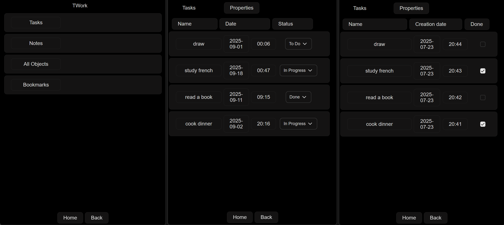

# AnyTask: Cross-Platform Client for Anytype

**A modern, lightweight client for Anytype built with Rust and Dioxus.**

[Anytype](https://github.com/anyproto/) has a great desktop, Android and iOS clients. This project focuses on cross-platform implementation of the client using [Dioxus](https://github.com/DioxusLabs/dioxus), a modern Rust framework. The goal is to raise phone and tablet experience to the level of the Anytype desktop app.

**⚠️ AnyTask is currently in early development.**

<!--
<div align="center">
  
</div>
-->

## Real-time Property Management

<div align="center">
  
</div>

## Customizable Object Views

<div align="center">
  
</div>

## Features

- [x] Login with 4-digit code
- [x] Views: Spaces, Lists, Objects
- [x] Properties: Text, Checkbox, Select, Date, etc.
- [x] Customize properties appearence in Lists
- [x] Live property update on value change
- [x] Use different List views
- [x] Open last visited view after app reload
- [ ] Standalone app (independent of Anytype desktop)
<!--- [ ] Timeline/Calendar view-->

## Developing

### NixOS

You can install development environment with all dependencies using [devenv](https://devenv.sh/).

```bash
devenv shell -v
```

```bash
devenv tasks run engine:build           # build anytype-heart library
devenv tasks run engine:build-linux     # build anytype-heart library for linux
devenv tasks run engine:build-android   # build anytype-heart library for android
devenv tasks run engine:build-windows   # build anytype-heart library for windows

```

#### Other (Windows, Linux, Mac)

### Dependencies

- [dioxus-cli](https://github.com/DioxusLabs/dioxus)

```bash
cargo install --git https://github.com/DioxusLabs/dioxus dioxus-cli --locked
```

### Running

#### Desktop

```bash
dx serve --platform desktop
```

#### Android

- Android
  - Settings
  - Developer options
  - Wireless debugging (turn on, then hold)
  - Pair device with pairing code (`ip:port`, `code`)
- Terminal
  - Connect to device
    - `adb pair ip:port` - connect to device with wireless debugging
    - `code` - verify with code
    - `adb devices` - check connected devices
  - Run the app on the connected device
    ```bash
    dx serve --platform android --device
    ```
  - Debug
    - `adb shell run-as com.Tumypmyp.AnyTask` - login to Android shell
    - `ls files` - check app files directory

### Building installer

#### Desktop

```bash
dx bundle --desktop
```

#### Android

```bash
dx bundle --android
```

or

```bash
(devenv) bundle-android-apk
```
